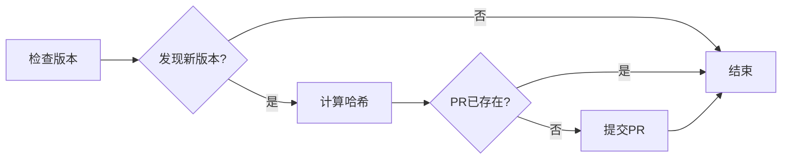

# Winget Auto-Updater

自动监控软件版本并提交更新到 [winget-pkgs](https://github.com/microsoft/winget-pkgs) 的工具。

## 功能特点

- 🔄 **自动版本检测** - 定期检查软件的最新版本
- 📦 **自动提交 PR** - 发现新版本后自动创建 Pull Request
- 🛡️ **防重复提交** - 检查是否已存在相同版本的 PR
- 📊 **详细日志** - 记录每次检查和提交的详细过程
- 🔁 **重试机制** - 网络请求失败时自动重试
- 🔐 **GitHub API 认证** - 支持认证以提高 API 速率限制

## 项目结构

```
winget-auto-update/
├── .github/
│   └── workflows/
│       └── update.yml        # GitHub Actions 工作流
├── packages/                  # 软件包配置
│   ├── Notepad++.Notepad++.yaml
│   ├── Readdle.Spark.yaml
│   └── Xdown.Xdown.yaml
├── scripts/                   # PowerShell 脚本
│   ├── calc-hash.ps1         # 计算安装包哈希
│   ├── check-existing-pr.ps1 # 检查 PR 是否存在
│   ├── check-version.ps1     # 主版本检查脚本
│   ├── github-assets.ps1     # GitHub Releases 解析
│   ├── infer-version-from-filename.ps1
│   ├── resolve-download.ps1  # 解析下载链接
│   ├── resolve-version.ps1   # 解析版本号
│   ├── scan-url-version.ps1  # 扫描 URL 中的版本
│   └── submit-winget.ps1     # 提交到 winget-pkgs
└── logs/                      # 运行日志（自动创建）
```

## 工作流程



## 软件包配置

在 `packages/` 目录下创建 YAML 文件：

```yaml
id: Publisher.PackageName          # winget 包 ID
checkver:
  url: https://example.com/download # 版本检测页面
  regex: version-([0-9.]+)         # 版本号正则表达式
autoupdate:
  architecture:
    x64: https://example.com/download/$version/app-x64.exe
    x86: https://example.com/download/$version/app-x86.exe
```

### GitHub Releases 配置

如果软件发布在 GitHub，可以简化配置：

```yaml
id: Publisher.PackageName
checkver:
  url: https://github.com/user/repo
```

脚本会自动：
- 获取最新 release 的版本号
- 解析所有平台的安装包
- 智能过滤（排除源码、Linux、macOS 等）

## 本地运行

### 前置条件

1. PowerShell 7+
2. 安装依赖：

```powershell
Install-Module powershell-yaml -Scope CurrentUser -Force
winget install wingetcreate --source winget
winget install GitHub.cli
```

### 运行检查

```powershell
# 设置环境变量（可选，用于 GitHub API 认证）
$env:GITHUB_TOKEN = "your-github-token"

# 运行版本检查
pwsh ./scripts/check-version.ps1
# 或 PowerShell 5: powershell -File ./scripts/check-version.ps1

# 提交更新（需要 winget-pkgs 写权限）
$env:WINGET_TOKEN = "your-winget-token"
pwsh ./scripts/submit-winget.ps1
```

## GitHub Actions 配置

项目包含 GitHub Actions 工作流，每 6 小时自动运行一次。

### 配置 Secrets

在仓库设置中添加以下 Secrets：

| Secret | 说明 |
|--------|------|
| `WINGET_TOKEN` | 用于提交 PR 的 GitHub Personal Access Token |
| `GITHUB_TOKEN` | （可选）用于提高 API 速率限制 |

### 手动触发

在 Actions 页面点击 "Run workflow" 可以手动触发。

## 添加新软件包

1. 在 `packages/` 目录创建新的 YAML 文件
2. 提交并推送到仓库
3. 等待下次自动运行或手动触发

## 许可证

MIT License
